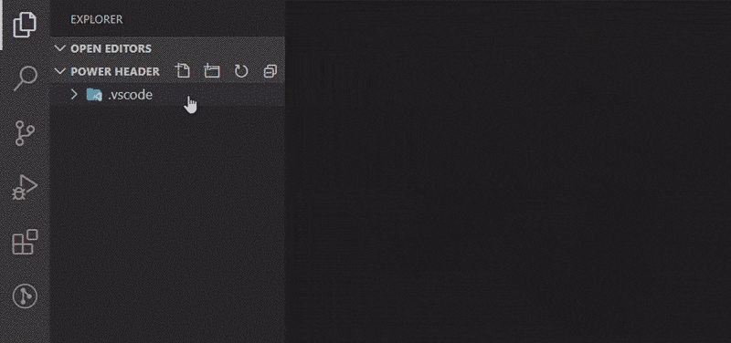

<h1 style="text-align: center;font-weight: bold;">
👊 Power Header 💥<br/>
<br/>

</h1>

**Power Header** automatically (or by command or shortcut) inserts (and updates) file header text (author comment).  
**Power Header** offers easy configuration and powerful customization to fit any needs!



## Features

> This is just an abridged description. Please see in **Power Header** settings for all the juicy delicious details 🤤

| What you ask for ❔ | What you get ❗ |
|:-:|---|
| 🗃️ Supported Languages | 💯% all of them! |
| ⏩ Automatic Header Insert and Update | Yes, sir!<br/>Automagically ✨ insert header into new files (🛑 black-/whitelist-support *of course*) and update on save.<br/>Not a single keyboard shortcut pressed! |
| 📄 Header Template | can be a **text string**, 😐<br/>read from a **local file**, 😲<br/>or even a **remote resource**! 🤯 (http(s)://)|
| 🔀 Variables for Interpolation in Template | **Ain't no hard-coded fields BS here!**<br/>You can do whatever the f🤐 you want!<br/>Use all [vscode snippet variables](https://code.visualstudio.com/docs/editor/userdefinedsnippets#_variables) and define custom variable pairs -- they can even be JavaScript code, allowing for arbitrary complex text, date formats, etc.! |
| 💬 Comment Styles | ⬛ Block Comment style,<br/>➖ Line Comment style,<br/>📃 or Insert header as is. |
| 🔄 Header Content Update | Update the header via command/shortcut or automatically on file save.<br/>JavaScript regular expression replace allows for arbitrary complex text updates. 🎉<br/>Use with caution ⚠️ |
| Wow, all this is awesome 😮, but I have that super rare special edge-case in my multi-root workspace for this file language 🥺<br/>*-- I hear you say* ⁉ | Harness the full **Power Header** and *VS Code* built-in power 💥<br/>You can always overwrite all **Power Header** settings in a (*Workspace* or *.vscode* folder) *settings.json*, even language specific: `"[<language>]": { "powerHeader.<setting>": ... }`, to achieve your desired header style 👍 |

## Use Case Examples (extending default settings)

1. Insert a simpler header in plain text files (via command/shortcut) ⚙️ *User settings.json*
	```json
	"[plaintext]": {
		"powerHeader.commentMode": "raw",
		"powerHeader.template": "Author: <author> (email) / $TM_FILENAME @ !date!"
	}
	```
	let's make this work ⏩ automatically for plain text files only:
	```jsonc
	"[plaintext]": {
		"powerHeader.autoInsert.enable": true,
		"powerHeader.autoInsert.allow": "always",
		"powerHeader.commentMode": "raw",
		"powerHeader.template": "Author: <author> (email) / $TM_FILENAME @ !date!"
	}
	```
1. Other header for that client project ⚙️ *Workspace settings.json*
	```jsonc
	"powerHeader.template": "file://$WORKSPACE_FOLDER/dev/template.txt"
	```
1. You company requires you to use a specific header template in `cpp` ⚙️ \<any>
	```jsonc
	"[cpp]": { 
		"powerHeader.commentMode": "line",
		"powerHeader.template": "https://intranet.company.com/static/templates/cpp/header",
	}
	```

## Extension Settings

See *Feature Contributions* tab⤴️ and better check in *Settings*➡️*Extensions*➡️**Power Header** for detailed explanation.

> Unfortunately current *Feature Contributions* Description column does not support markdownDescription [🐞 issue](https://github.com/microsoft/vscode/issues/88927)

## Known Issues

🙅
